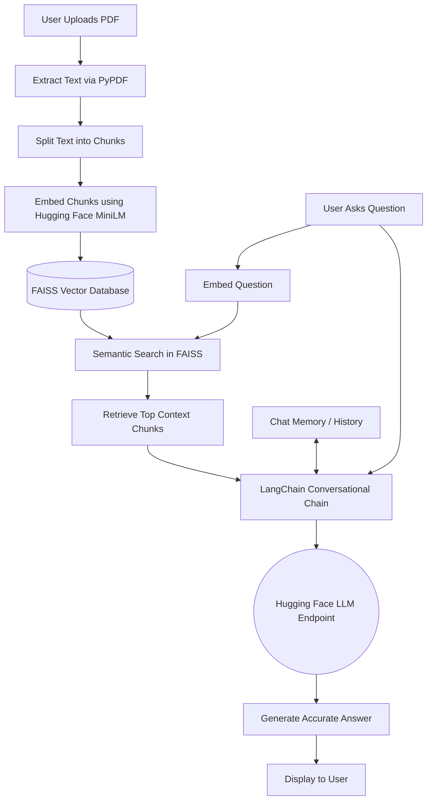

# 📚 RAG Chatbot: Intelligent Document Q&A 🤖


An end-to-end **Retrieval-Augmented Generation (RAG)** application that allows users to upload PDF documents and interact with them using natural language. The system securely processes the document text, converts it into semantic vector embeddings, and uses advanced Language Models to answer user queries with high accuracy and strict adherence to the provided context.

---

## ✨ Features

*   📄 **PDF Text Processing:** Robust extraction of text from single or multiple PDF documents.
*   🧠 **Semantic Search Vector Database:** Uses `FAISS` and `Hugging Face MiniLM` embeddings for hyper-fast, in-memory semantic similarity search.
*   💬 **100% Free Open-Source LLMs:** Utilizes state-of-the-art open-source LLMs (like Mistral) via the Hugging Face Inference API for completely free generation—no OpenAI billing required!
*   🕰️ **Conversational Memory:** Remembers the context of previous questions to enable natural follow-up conversations.
*   ⚡ **Interactive UI:** A clean, responsive interface built with Streamlit.

---

## 🏗️ System Architecture



---

## 🚀 Getting Started

### Prerequisites
*   Python 3.9+
*   A free Hugging Face account ([Create one here](https://huggingface.co/join))

### Installation

1.  **Clone the repository:**
    ```bash
    git clone https://github.com/Chandrkant07/Rag-Chatbot-for-QnA.git
    cd Rag-Chatbot-for-QnA
    ```

2.  **Install the required dependencies:**
    ```bash
    pip install -r requirements.txt
    ```

3.  **Configure Environment Variables:**
    *   Create a `.env` file in the root directory.
    *   Add your free Hugging Face API token:
        ```env
        HUGGINGFACEHUB_API_TOKEN="your-huggingface-token"
        ```

4.  **Run the application:**
    ```bash
    streamlit run app.py
    ```

---

## 👨‍💻 Interview Explanation Guide

*Use this section as a reference to explain the technical decisions behind this project.*

**1. "Can you explain what this project is and why you built it?"**
> "I built this Retrieval-Augmented Generation (RAG) chatbot to automate the process of extracting insights from long PDFs. Instead of manually searching through documents, users can ask natural language questions. The application acts as a bridge between the user's private data and large language models, significantly reducing information retrieval time."

**2. "Walk me through the architecture. How does it work end-to-end?"**
> "The pipeline has two main phases: Ingestion and Retrieval/Generation.
> *   **Ingestion:** I use `PyPDF` to extract document text. Since LLMs have token limits, I chunk the text using LangChain's `RecursiveCharacterTextSplitter`. These chunks are passed through a local Hugging Face embedding model (`all-MiniLM-L6-v2`) to create high-dimensional vectors, which are indexed in a local FAISS database.
> *   **Retrieval & Generation:** When a question is asked, it's embedded using the same model. FAISS performs a cosine similarity search to fetch the most relevant text chunks. I then inject the user's question, the retrieved chunks, and the conversational history into a Hugging Face LLM (like Mistral) using LangChain. The LLM then synthesizes a final answer strictly based on the provided context."

**3. "Why did you choose FAISS and Hugging Face over cloud alternatives like Pinecone or OpenAI?"**
> "My goal was to build a highly capable, yet cost-efficient and open-source system. 
> *   I chose **FAISS** because it operates locally in-memory, making it incredibly fast and completely free for individual or small-scale document analysis, avoiding the latency and costs of a hosted vector database. 
> *   For the LLM and Embeddings, I used **Hugging Face**. By utilizing `MiniLM` locally and the Hugging Face Inference API for text generation (e.g., Mistral), I eliminated the vendor lock-in and quota limitations associated with paid APIs like OpenAI. This demonstrates an ability to build production-ready AI solutions without relying on expensive infrastructure."

**4. "How do you handle conversational context?"**
> "I implemented a memory buffer using Streamlit's `session_state` and LangChain's `ConversationBufferMemory`. When a follow-up question is asked, the system doesn't just search for the new question. It uses the LLM to analyze the chat history and rephrase the follow-up question into a standalone query. It then searches the FAISS index with that standalone query to ensure accurate retrieval."
